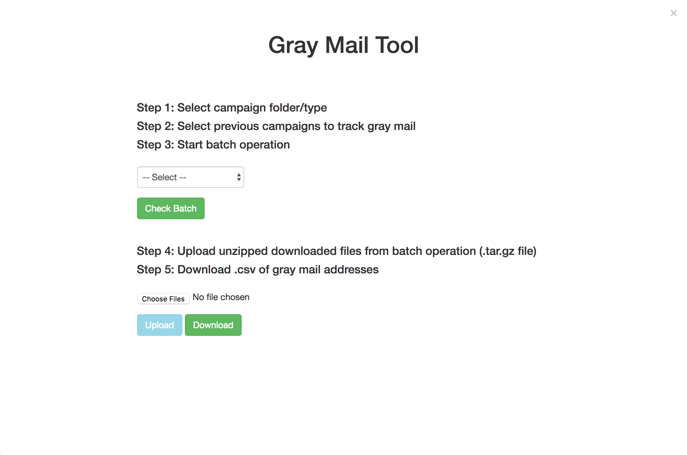

# Gray Mail Project

[![NPM Version][npm-image]][npm-url]
[![Build Status][travis-image]][travis-url]
[![Downloads Stats][npm-downloads]][npm-url]

> A tool to automate the retrieval and removal of inactive UIE group subscribers.

With UIE's ever-growing list of subscribers (50K+ at the time of writing this), an effort is being made to reduce the number of email addresses found in our newsletter groups to include those that show engagement in opening or clicking on our campaigns while extracting those email addresses that have been deemed inactive, or _gray mail_. This ensures that active subscribers comprise the majority of recipients of UIE's weekly email campaigns and prevents gray mail subscribers from receiving spam.

In testing our subscriber data through the course of this project, a total of ten unopened email campaigns in a given email newsletter (e.g., Articles and Podcasts, UX Thought of the Day) was determined to be the main qualifier for gray email addresses. Although this metric has been used as a delimiter, the current version of this tool was developed to allow the user to determine this number by selecting which specific campaigns (displayed with title and send date) are used.


## Installation

If not already done so, begin by downloading [MAMP or MAMP PRO][mamp] onto your machine. A license may be provided to you for the installation of MAMP PRO by UIE's System Administrator.

Clone the repository and set the _Document root_ in MAMP to the included directory labeled _gray-mail-tool_. Back in the main project directory (_gray-mail-tool-master_), create a file named `config.ini` and enter your Mailchimp API key in the following format:

```
apiKey = 'xxxxxxxxxxxxxxxxxxxxxxxxxxxxxxxx-us5'
```

_For more information on generating and accessing API keys through Mailchimp, visit [Mailchimps's API Documentation][mc-api]_

    .
    ├── gray-mail-tools  
        ├── uploads                 # Folder generated by tool to store uploaded files
        ├── grayMailTool.php        # Gray Mail Tool, main file
        ├── report.csv              # Output file to be downloaded
        ├── style.css               # Custom stylesheet
    ├── config.ini                  # API key access
    └── README.md

### MAMP Configuration File Edits

#### php.ini file
To edit the `php.ini` file, open MAMP PRO and navigate to the path: *File > Edit Template > PHP (php.ini)*. From the dropdown menu, select the file that corresponds with the latest PHP version.

Edit the following:
```
file_uploads = On
```

```
upload_max_filesize = 128M
```

```
post_max_size = 128M
```

#### .htaccess file in /Applications/MAMP/htdocs
Find and enter the following (file may not have content):
```
RewriteEngine On
php_value max_file_uploads 100000
```

#### httpd.conf in /Applications/MAMP/conf/apache/
Find and edit the following:
```
<Directory />
    Options Indexes FollowSymLinks
    AllowOverride All
</Directory>
```

## Usage example
Enable the tool by running your MAMP server (clicking on the 'Servers' power button) and clicking on 'WebStart'. This will open your server on your browser beginning with `localhost:_your_port_number_/`. Change this url to `localhost:_your_port_number_/grayMailTool.php` and hit enter.

<!-- ### Gray Mail Tool -->


<!-- To use, follow step-by-step instructions given on tool's interface. -->

#### Step 1

Begin by selecting the campaign folder you wish to extract gray mail addresses from. Wait a few seconds for the most recent campaigns for the given campaign type to load.

#### Step 2
Once recent campaigns have loaded, choose multiple campaigns you wish to use in identifying inactive subscribers. The gray mail list generated will be of subscribers who have not opened all of these chosen campaigns.

_**Important Note**: Campaign folders and recent campaigns are loaded from MailChimp's campaign folders, so make sure that all campaign filing is up to date before using tool._


#### Step 3

Mailchimp's API offers the ability to complete multiple tasks with just one call using batch operations. In this step, the campaigns you've downloaded from Mailchimp will be submitted to retrieve data on each.

Once the *Start Batch* button is selected and the batch request is submitted to Mailchimp, the button will change to green and be used to *Check Batch*. Depending on the size of the file uploaded, this process may take several to many hours. Once a batch is in progress, an 'x' will appear on the top right side of the screen. This signifies that a session is in progress and if closed, the session will be aborted. The process will still run if computer is closed or turned off.


A text display will appear on the bottom giving a status update on the batch's progress whenever the *Check Batch* button is selected.

For more details, view batch progress on Mailchimp at the [Mailchimp Playground][mc-playground] by first entering your API key. Select **Batches** and identify your batch process corresponding to the _Batch ID_ found in the tool's display.

#### Step 4

Once the batch process has completed, you can click on the _Click here to download output_ link to download the compressed batch files in the .tar.gz format.


On your machine unzip the .tar.gz file and rename the folder to something you can reference. Back in the gray mail tool, select the **choose files** button and select all the .json files using `Command + A`. There should be a large number of files in this folder, each corresponding to a separate campaign. This happens to be the way Mailchimp sends back subscriber data.
<!--  -->


#### Step 5

Once the **Upload** button is selected, the files will be processed and the **Upload** button will change into a green **Download** button. Click on this to download a dated .csv file containing all gray mail addresses for the selected campaign type.



*Note: Once files have been uploaded, downloading the .csv file is required before uploading again (as indicated by the green download button persisting).*

## Built With
* PHP
* Mailchimp API
* jQuery
* Bootstrap
* HTML


## Authors

* **Miguel Cepeda** - [GitHub](https://github.com/migueldcepeda)

## License

This project is licensed under the MIT License - see the [LICENSE.md](LICENSE.md) file for details

## Acknowledgments

* UIE

[npm-image]: https://img.shields.io/npm/v/datadog-metrics.svg?style=flat-square
[npm-url]: https://npmjs.org/package/datadog-metrics
[npm-downloads]: https://img.shields.io/npm/dm/datadog-metrics.svg?style=flat-square
[travis-image]: https://img.shields.io/travis/dbader/node-datadog-metrics/master.svg?style=flat-square
[travis-url]: https://travis-ci.org/dbader/node-datadog-metrics
[mamp]: https://www.mamp.info/en/downloads/
[mc-api]: https://kb.mailchimp.com/integrations/api-integrations/about-api-keys
[mc-export]: https://kb.mailchimp.com/lists/manage-contacts/view-or-export-a-list
[mc-playground]: https://us1.api.mailchimp.com/playground/

<!-- ## Config files

#### Applications/MAMP/conf/php\_latest\_version\_/php.ini OR /Library/Application Support/appsolute/MAMP PRO/conf/php.ini OR Check with phpinfo()

#### File Uploads
`file_uploads = On`

`upload_max_filesize = 32M`

#### .htaccess file in /Applications/MAMP/htdocs
```
RewriteEngine On
php_value max_file_uploads 100000
```

#### httpd.conf in /Applications/MAMP/conf/apache/
```
<Directory />
    Options Indexes FollowSymLinks
    AllowOverride All
</Directory>
``` -->
